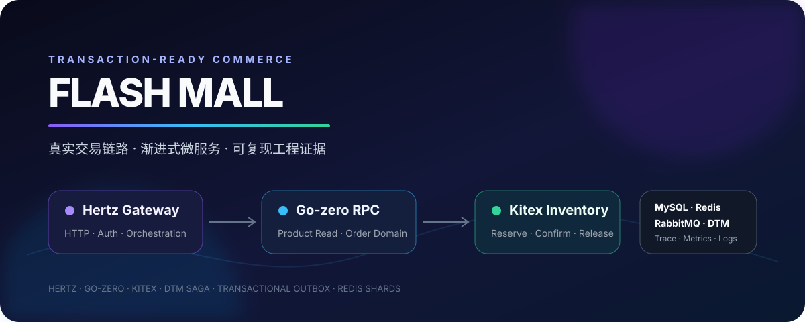
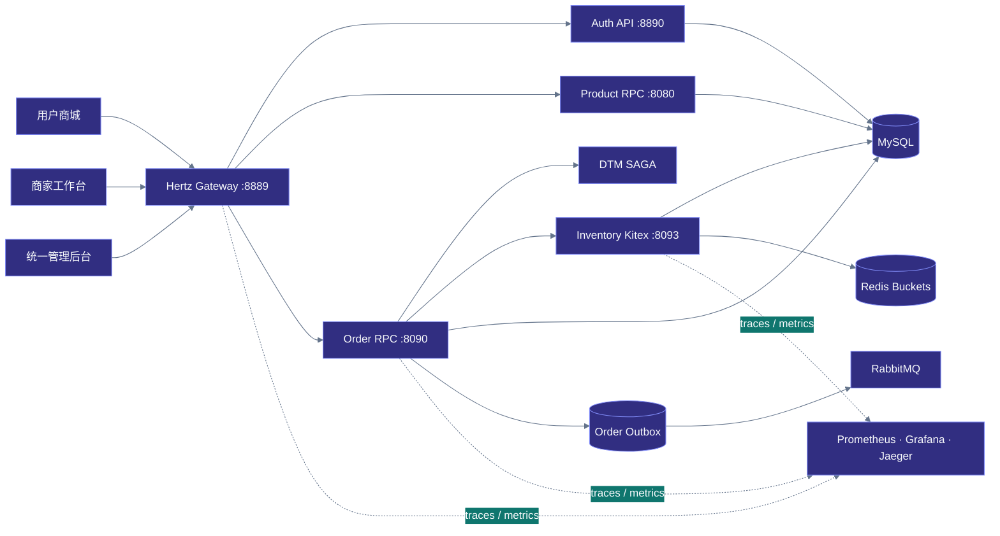
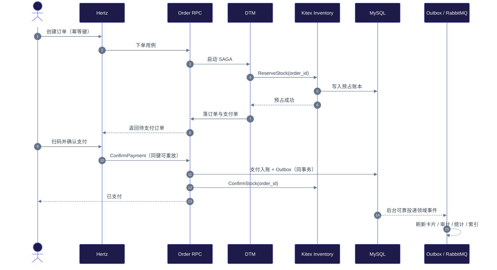

<a id="readme-top"></a>

<div align="center">

# Flash Mall

**面向真实交易链路的云原生微服务商城**

[](https://github.com/mildred522/flash-mall/actions/workflows/ci.yml)


[快速开始](#quick-start) · [架构](#architecture) · [交易链路](#transaction-flow) · [可靠性](#reliability) · [性能](#performance) · [文档](#documentation)



Flash Mall 不只是商品 CRUD。它覆盖用户商城、商家工作台、统一管理后台和桌面控制中心，并把库存一致性、支付幂等、分布式事务、异步事件、缓存治理、故障恢复与性能证据放进一条可实际运行的电商链路。

</div>

> [!IMPORTANT]
> 当前默认运行拓扑以 **Hertz 网关**作为外部入口，Go-zero 承担商品读与订单领域 RPC，Kitex 收敛库存写命令。历史 Entry API 只作为对比基线，不进入默认启动链路。

<a id="quick-start"></a>

## Quick Start / 快速开始

### Prerequisites / 环境要求

- Ubuntu / WSL Ubuntu，Docker Engine 与 Docker Compose v2 可用
- Go `1.24.x`（业务镜像在宿主机编译后装入轻量运行镜像）
- 建议至少 4 核 CPU、8 GiB 内存；完整可观测套件会额外占用资源

首次使用时拉取固定的基础设施镜像：

```bash
for image in \
  yedf/dtm \
  bitnamilegacy/etcd:3.5 \
  mysql:5.7 \
  redis:8.8.0 \
  rabbitmq:3.12-management \
  jaegertracing/all-in-one:1.57 \
  prom/prometheus:v2.53.0 \
  grafana/grafana:11.1.0; do
  docker pull "$image"
done
```

在仓库根目录构建并启动完整演示环境：

```bash
./scripts/local/flash-mall-control.sh rebuild --profile interview --observability
./scripts/local/flash-mall-control.sh verify-demo
```

| 入口 | 地址 | 用途 |
|---|---|---|
| 用户商城 | [127.0.0.1:8889](http://127.0.0.1:8889) | 浏览店铺与商品、下单、扫码沙箱支付、退款 |
| 商家工作台 | [127.0.0.1:8889/merchant](http://127.0.0.1:8889/merchant) | 店铺装修、商品与库存、订单和退款管理 |
| 统一管理后台 | [127.0.0.1:8889/admin](http://127.0.0.1:8889/admin) | 商家审核、首页橱窗、运营与对账 |
| Grafana | [127.0.0.1:3000](http://127.0.0.1:3000) | 自动配置的服务与交易面板 |
| Jaeger | [127.0.0.1:16686](http://127.0.0.1:16686) | 跨 Hertz、RPC 与库存命令的调用追踪 |
| RabbitMQ | [127.0.0.1:15672](http://127.0.0.1:15672) | Outbox 事件和消费者观察 |

> [!TIP]
> Windows 用户可运行 `pwsh -NoProfile -File scripts/local/install-desktop-launcher.ps1`，在桌面生成 **Flash Mall 控制中心**，以独立窗口完成启动、停止、重建、状态检查与日志查看。

<a id="highlights"></a>

## Project Highlights / 项目亮点

- ⚡ **读写分工明确：** Hertz 处理 HTTP 与业务编排，Go-zero RPC 保留稳定的商品读和订单领域能力，Kitex 专注库存预占、确认、释放等高频写命令。
- 🧭 **完整经营闭环：** 用户侧、商家侧与管理员侧权限隔离；商家独立经营店铺，管理员以销量、库存、促销、新鲜度和商家多样性辅助编排首页橱窗。
- 🧱 **库存一致性可恢复：** Redis 分桶承载热点库存，Lua 保证单次原子扣减；MySQL 保存库存事实、预占账本和操作日志，服务重启可重建缓存状态。
- 🔁 **交易幂等贯穿链路：** `order_id`、请求 ID 和幂等键跨服务传播；重复下单、支付确认、空补偿和重复释放均有明确语义。
- 📮 **非关键工作异步化：** Transactional Outbox 与 RabbitMQ 在支付事务后更新商品卡片、库存审计、运营统计和搜索索引，不拉长同步支付路径。
- 🧊 **多层缓存防护：** 进程内 L1、Redis L2、软/硬 TTL、随机抖动、Singleflight、过期数据兜底、负缓存和 Bitmap Bloom Filter 共同处理雪崩、击穿与穿透。
- 🔭 **观测与恢复可验证：** Prometheus、Grafana、Jaeger 覆盖 RED 指标、库存命令、Outbox、悬挂预占和不一致数；故障注入验证 MySQL、Redis、RabbitMQ 与内部服务恢复。
- 📈 **性能结论有证据边界：** 基准、负载、压力、五分钟稳定性和恢复测试同时校验吞吐、尾延迟与业务不变量，不用单一峰值替代系统正确性。

<a id="architecture"></a>

## Architecture / 系统架构



| 边界 | 主要职责 | 技术选择 |
|---|---|---|
| 接入与编排 | 路由、鉴权、HTTP 适配、商城及后台用例编排 | Hertz + `application/ports/adapters` |
| 认证 | 密码/验证码登录、会话、角色与安全事件 | Go-zero API + MySQL + Redis |
| 商品读 | 商品目录、详情与商品卡片快照 | Go-zero RPC + 分层缓存 |
| 订单领域 | 下单、支付单、退款、对账、Outbox 与恢复任务 | Go-zero RPC + DTM SAGA |
| 库存写 | 预占、确认、释放、调账与分桶恢复 | Kitex + Redis Lua + MySQL 账本 |

<a id="transaction-flow"></a>

## Transaction Flow / 核心交易链路



支付默认使用本地二维码沙箱，便于离线演示完整状态机；配置支付宝沙箱参数后，可切换到 RSA2 签名、异步通知验签、查询、关单与退款链路。无论渠道如何变化，支付单、幂等入账、库存确认和 Outbox 语义保持一致。

<a id="reliability"></a>

## Reliability / 一致性与可靠性

| 风险 | Flash Mall 的处理方式 | 可观测证据 |
|---|---|---|
| 热点商品超卖 | Redis 分桶 + Lua 原子预占；结算以 Kitex 写结果为准 | 预占成功率、负库存数、Redis/MySQL 差异 |
| 重复请求与网络重试 | `order_id` 与幂等键绑定业务结果，状态机拒绝非法跃迁 | 重复订单数、支付回调唯一性 |
| SAGA 前向步骤失败 | ReleaseStock 支持空补偿和重复调用安全 | 库存日志、预占账本状态 |
| 支付成功但库存确认暂时失败 | 持久化待恢复状态，后台任务重试确认 | 未完成确认数、恢复任务指标 |
| 数据库提交成功但消息未发送 | 业务数据与 Outbox 同事务，发布器确认后再标记成功 | Outbox 积压、失败次数、最老事件年龄 |
| 缓存不可用或批量过期 | L1/L2、TTL 抖动、Singleflight 与 stale fallback | 缓存命中、回源、过期兜底指标 |
| 服务或基础设施短暂中断 | 就绪探针、连接重试、持久卷与受控恢复脚本 | Prometheus `up`、Jaeger Trace、恢复报告 |

> [!NOTE]
> 安全、鉴权、审计和幂等不依赖传输框架。Kitex 的落点来自稳定 IDL、领域边界和连接治理需求，而不是把“更安全”或“更快”简单等同于某个 RPC 框架。

<a id="observability"></a>

## Observability / 可观测性

启动时添加 `--observability` 即可获得自动配置的监控环境：

- **Grafana：** 服务 RED、容量与 SLO、库存命令、Outbox 和业务一致性面板。
- **Prometheus：** 抓取 Hertz、Product RPC、Order RPC 与 Inventory Kitex 指标，并加载告警规则。
- **Jaeger：** 通过请求 ID、订单 ID 和幂等键串联 HTTP、RPC、库存命令与支付 Span。
- **结构化日志：** 控制中心按服务读取日志；访问、异常、库存、支付和事件投递均保留上下文。

```bash
./scripts/local/flash-mall-control.sh status
./scripts/local/flash-mall-control.sh logs order-rpc
```

<a id="performance"></a>

## Performance / 性能证据

最近一次完整复测运行在 **4 vCPU / 约 7.76 GiB 的共享 WSL Docker 环境**。数字用于建立本项目的可复现容量边界，不代表公网生产规格。

| 链路 | 最后通过档位 | 首次失败档位 | 主要瓶颈证据 |
|---|---:|---:|---|
| 公开读混合 | 19,200 TPS | 20,800 TPS | 高档位受 Hertz 与压测机 CPU 共同影响 |
| 订单创建/取消 | 150 TPS | 165 TPS | `cancel_order`、MySQL CPU 与活跃线程 |
| 下单/支付/确认完整交易 | 120 TPS | 128 TPS | `confirm_payment` 与同步强一致事务 |

性能套件覆盖正确性基线、预期负载、自适应压力、闭环饱和、五分钟稳定性、幂等重放、RabbitMQ 中断恢复和最终数据不变量。一次 Outbox 批量抢占优化将 MySQL `COMMIT` 平均等待降低 **17.4%**，但端到端上限没有显著提升，因此最终结论仍指向同步交易持久化，而不是把局部指标包装成 QPS 提升。

```bash
# 快速回归：正确性 + 低成本性能验证
./scripts/perf/run-performance-suite.sh \
  --suite quick --allow-mutation --confirm-reset

# 完整证据链：基准、负载、压力、稳定性与恢复
./scripts/perf/run-performance-suite.sh \
  --suite full --allow-mutation --confirm-reset
```

> [!WARNING]
> 性能套件会生成订单、调整压测库存并在前后受控重置演示数据，只能对本机回环地址执行。运行前请确认没有需要保留的本地演示交易。

详细方法、环境和结果见[性能测试方法](docs/PERFORMANCE_TESTING.md)与[最新性能分析](docs/PERFORMANCE_ANALYSIS_20260820.md)。

<a id="verification"></a>

## Verification / 工程验证

```bash
# 后端静态检查与测试
go vet ./...
go test ./...

# 前端测试与三端生产构建
cd frontend
npm ci
npm test
npm run build

# Docker 演示数据、账号与库存一致性
cd ..
./scripts/local/flash-mall-control.sh verify-demo
```

CI 按变更范围分层：日常提交执行快速静态检查、单元测试和构建；完整链路、性能与故障恢复保留为显式重型验证，避免高速迭代期间让每次小改动承担整套环境成本。

<a id="documentation"></a>

## Documentation / 深入阅读

| 文档 | 内容 |
|---|---|
| [当前项目状态](docs/CURRENT_PROJECT.md) | 唯一有效的代码现状、运行拓扑、已验证能力与历史结果索引 |
| [架构亮点](docs/ARCHITECTURE_HIGHLIGHTS.md) | 库存、支付、Outbox、缓存与服务边界的设计取舍 |
| [面试讲解指南](docs/INTERVIEW_GUIDE.md) | 从业务问题到架构证据的完整叙事路线 |
| [性能测试方法](docs/PERFORMANCE_TESTING.md) | 场景模型、SLO、容量边界、稳定性与恢复门禁 |
| [最新性能分析](docs/PERFORMANCE_ANALYSIS_20260820.md) | MySQL 瓶颈定位、Outbox 优化复测与结论边界 |
| [简历项目文本](docs/RESUME_PROJECT.md) | 精炼后的项目介绍、职责与技术亮点 |

<details>
<summary><strong>演示账号</strong></summary>

| 身份 | 手机号 | 密码 | 说明 |
|---|---|---|---|
| 普通用户 | `13800000001` | `flashmall123` | 商城完整交易链路 |
| 管理员 | `13800000002` | `admin123` | 后台也提供一键管理员登录 |
| 山岚烘焙店主 | `13800001101` | `flashmall123` | 仅能访问商家 1101 的资源 |
| 北纬三十六店主 | `13800001102` | `flashmall123` | 仅能访问商家 1102 的资源 |

演示夹具版本为 `20260730_demo_fixture_v1`。如数据已被手工修改，可执行：

```bash
./scripts/local/flash-mall-control.sh reset-demo \
  --confirm-reset --profile interview
```

该命令先备份业务数据，再重置 MySQL/Redis 演示卷；上传素材卷会被保留。

</details>

<details>
<summary><strong>仓库结构</strong></summary>

```text
flash-mall/
├── app/
│   ├── auth/api/              # 认证与账号安全
│   ├── product/rpc/           # 商品读领域
│   ├── order/rpc/             # 订单、支付、退款与 Outbox
│   ├── inventory/kitex/       # 库存写命令
│   └── gateway/hertz/         # 外部入口与用例编排
├── frontend/packages/
│   ├── shop/                  # 用户商城
│   ├── merchant/              # 商家工作台
│   ├── admin/                 # 统一管理后台
│   └── shared/                # 三端共享前端能力
├── artifacts/web/             # 网关使用的统一静态产物
├── deploy/                    # Compose、K8s 与可观测配置
├── scripts/                   # 本地控制、CI、恢复与性能工具
├── benchmarks/                # 压测工具与冻结结果
└── tools/FlashMall.Launcher/  # Windows 桌面控制中心
```

</details>

<details>
<summary><strong>当前工程边界</strong></summary>

- 默认支付渠道是本地二维码沙箱；支付宝沙箱需要自行注入密钥，仓库不保存真实凭据。
- 服务共用一个 MySQL Server，并按 `mall_auth`、`mall_product`、`mall_order` 等 Schema 隔离；Hertz 中部分商家/运营用例仍通过适配器访问业务 Schema，这是已知的渐进式边界，不宣称数据库已完全按服务物理拆分。
- Inventory Kitex 与 Product RPC 当前共同围绕 `mall_product` 的库存事实工作；如果走向多团队独立部署，再迁移到独立库存 Schema 与数据所有权。
- 性能数字来自共享的本地 WSL Docker 环境，适合复现方法和解释瓶颈，不作为生产 SLA。
- Go-zero Entry API 保存在历史基线中用于同环境对比，不参与默认开发和演示拓扑。

</details>

<div align="right">

[回到顶部](#readme-top)

</div>
