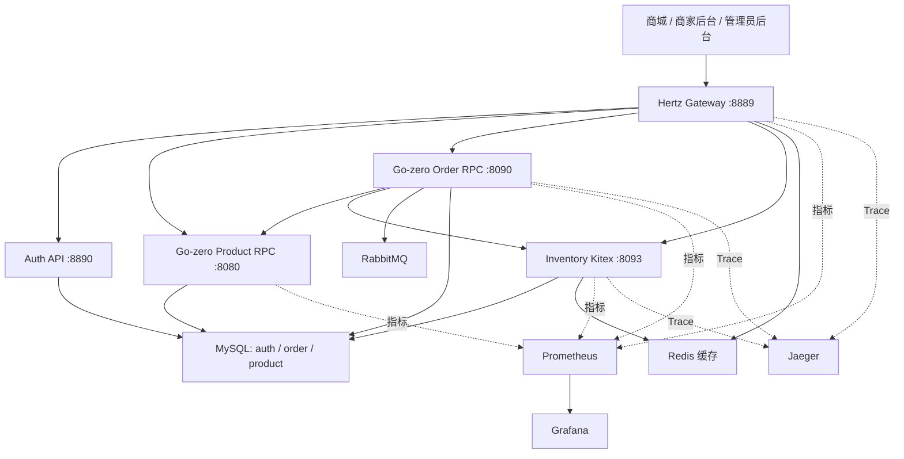
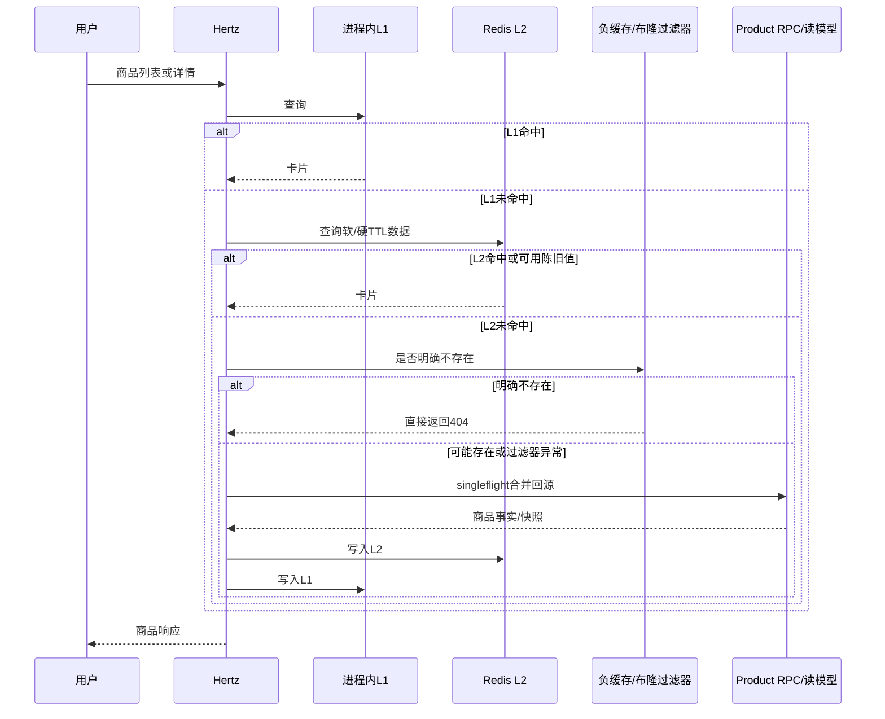
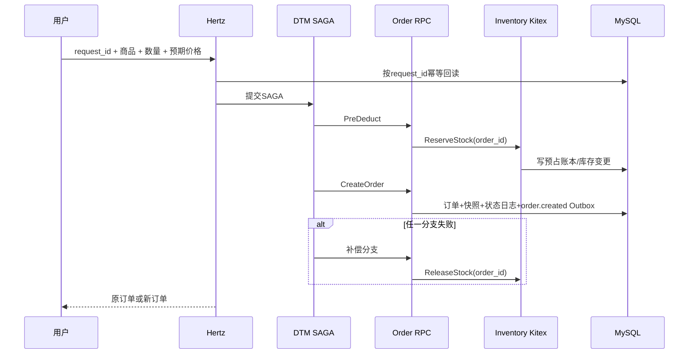
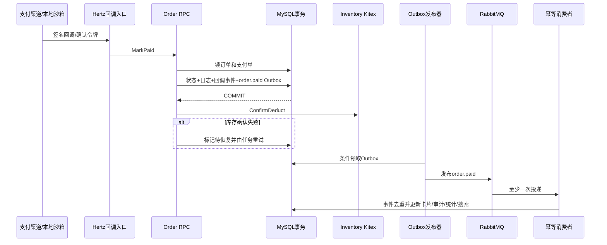

# Flash Mall 架构结构与亮点

> 本文回答三个问题：系统由什么组成，关键请求如何流动，每个面试亮点在代码和验证证据中如何落地。

## 1. 系统结构



### 1.1 外部入口

- `app/gateway/hertz`：当前唯一继续新增业务的HTTP网关。
- `frontend/packages/shop`：普通用户商城。
- `frontend/packages/merchant`：商家工作台。
- `frontend/packages/admin`：统一管理员后台。
- `artifacts/web`：三套前端的中立构建产物。
- `app/entry/api`：冻结的Go-zero Entry API，仅用于迁移对比和历史基线。

### 1.2 同步领域服务

| 服务 | 技术 | 数据所有权与职责 |
| --- | --- | --- |
| Auth API | Go-zero HTTP | 凭证、会话、验证码、安全审计 |
| Product RPC | Go-zero gRPC | 商品元数据、商品卡片和读模型 |
| Order RPC | Go-zero gRPC | 订单状态机、支付、退款、Outbox、恢复任务 |
| Inventory Service | Kitex + Thrift | 库存预占、确认、释放、调整、账本和对账 |

### 1.3 基础依赖

- MySQL：三个逻辑库分别保存认证、订单/支付和商品/库存事实。
- Redis：商品/店铺/橱窗缓存、库存热数据、短期幂等与分布式租约。
- RabbitMQ：支付成功后的非关键派生事件。
- DTM：创建订单SAGA分支编排与Barrier。
- Etcd：Go-zero RPC注册与发现。
- Prometheus、Grafana、Jaeger：指标、面板、告警和分布式追踪。

## 2. Hertz内部结构

```text
app/gateway/hertz/internal/
├── handler/       HTTP参数、身份、错误与响应映射
├── application/   用例级业务规则与编排
├── ports/         应用层依赖接口
├── adapters/      MySQL、Order RPC、Inventory Kitex实现
├── cache/         L1/L2缓存协调与跨实例失效
├── existencefilter/ 商品存在性过滤器与负缓存
├── assetstore/    上传素材存储和完整性审计
├── middleware/    认证、日志、恢复、RED指标和Trace
└── svc/           依赖装配与生命周期
```

边界约束：

- Handler只负责HTTP适配、鉴权和结果映射，不写裸SQL或事务。
- SQL只能位于adapters；架构测试扫描生产Handler以阻止回退。
- 订单、库存写命令必须走RPC边界；Hertz不能直接更新订单或库存事实。
- DDL只存在于版本化结构脚本，运行代码只能执行只读schema readiness检查。

## 3. 关键业务链路

### 3.1 商品读取



交易不变量：页面缓存库存只是展示；结算前仍必须由Inventory Kitex预占并由Order RPC校验价格。

### 3.2 创建订单



### 3.3 支付成功与异步派生



## 4. 核心亮点与证据

### 4.1 渐进式Hertz迁移，而非重写全部服务

**设计：** 外部HTTP入口迁移到Hertz，原Go-zero Entry API冻结为基线；商品和订单RPC继续复用，逐域把Hertz Handler中的查询和编排下沉到application与adapters。

**价值：** 控制迁移风险，保留成熟RPC治理能力，同时清理原入口中HTTP、SQL和业务规则耦合的问题。

**真实位置：**

- `app/gateway/hertz/internal/handler`
- `app/gateway/hertz/internal/application`
- `app/gateway/hertz/internal/adapters`
- `app/gateway/hertz/internal/architecture/dependencies_test.go`
- `benchmarks/results/entry-hertz-20260729.json`

**验证：** 固定两个分支提交、独立worktree、交替7轮成对实验。Hertz真实响应更大，仍未观察到读链路性能回退；结果明确不作为框架微基准。

**面试价值：** 展示存量系统迁移、兼容边界、分支基线管理和基于证据的技术选型。

### 4.2 Kitex只用于库存稳定命令

**设计：** Inventory Thrift IDL提供查询、种子、调整、预占、确认、释放、对账和运行状态；下单和支付经Order RPC调用Kitex库存服务。商品高频读取仍走Product RPC与缓存。

**价值：** 将库存写入收敛到唯一领域边界，又不为“统一框架”迁移成熟读路径。

**真实位置：**

- `idl/inventory.thrift`
- `app/inventory/kitex/handler.go`
- `app/inventory/service/service.go`
- `app/order/rpc/internal/inventoryclient/client.go`
- `app/gateway/hertz/internal/adapters/inventorykitex/client.go`

**面试价值：** 能解释Kitex、Go-zero RPC和HTTP网关各自适用位置，而不是罗列框架名。

### 4.3 库存热路径与持久化账本

**设计：** Redis保存按商品分桶的可用库存，Lua原子完成预占；MySQL保存库存事实、预占账本、变更日志和快照。`order_id`是预占身份，Release支持重复调用和空补偿；Inventory启动时从MySQL分桶、活动预占和扣减流水重建Redis，恢复任务继续处理过期、processing与dead letter。Product RPC遗留库存命令默认关闭，当前拓扑只允许Inventory写库存。

**价值：** 兼顾热点性能、可恢复性、幂等和审计，避免只用Redis后无法解释库存去向。

**真实位置：**

- `app/inventory/repository/stock_commands.go`
- `app/inventory/repository/reservation_ledger.go`
- `app/inventory/repository/reservation_reaper.go`
- `app/inventory/repository/redis_scripts.go`
- `app/inventory/repository/stock_persistence.go`
- `app/inventory/repository/runtime_recovery.go`

**不变量：** 可用量不为负；同一订单不能预占不同商品或数量；支付订单最终必须是CONFIRMED；失败订单不能永久悬挂。

**面试价值：** 可从Lua原子性一路讲到MySQL恢复事实、SAGA补偿和对账。

### 4.4 支付幂等与资金事实优先

**设计：** 回调先校验签名、时间、渠道、外部交易号和金额；Order RPC对订单和支付单行锁，在一个事务内推进状态机、记录回调事件、状态日志和Outbox。重复回调返回幂等成功。事务提交后才确认库存，失败进入持久化恢复。

**价值：** 防止重复入账，并避免库存瞬时故障让已收款订单被渠道反复回调。

**真实位置：**

- `app/gateway/hertz/internal/handler/payment_callback_protocol.go`
- `app/gateway/hertz/internal/handler/alipay_notification.go`
- `app/order/rpc/internal/logic/markorderpaidlogic.go`
- `app/order/rpc/internal/job/payment_recovery.go`
- `app/order/rpc/internal/paymentprovider`

**验证：** Windows Chrome实际对同一支付令牌确认两次，订单只转移一次；数据库仅一条成功回调事件，库存只最终确认一次。

**面试价值：** 展示真正的业务幂等由稳定身份、唯一约束、行锁和状态机共同构成。

### 4.5 Transactional Outbox与至少一次消费

**设计：** 订单/支付事务同步写入Outbox；发布器以Redis租约选主，条件领取事件，发布失败重试并进入dead状态。RabbitMQ消费者手动ACK，以事件ID写去重记录后更新派生投影。

**价值：** 消除数据库提交和消息发送之间的双写窗口，把非关键任务移出支付同步路径。

**真实位置：**

- `app/order/rpc/internal/job/outbox_publisher.go`
- `app/order/rpc/internal/job/rabbit_publisher.go`
- `app/order/rpc/internal/job/order_paid_projection.go`
- `deploy/observability/grafana/dashboards/payment-outbox.json`

**验证：** 容量实验暂停RabbitMQ后，支付仍成功；恢复后Outbox在90秒窗口内清空，最终没有pending、publishing或dead残留。

**面试价值：** 能准确解释Outbox是事务消息模式而不是MySQL内置中间件，并说明至少一次投递为何要求消费幂等。

### 4.6 L1/L2分层缓存与三类缓存风险治理

**设计：** L1为进程内短TTL缓存，L2为Redis；缓存条目包含软/硬TTL，支持稳定抖动、singleflight、后台刷新和原点失败陈旧值兜底。商品、店铺和橱窗写入后精确失效，并通过Redis Pub/Sub广播其他Hertz实例清除L1。

**解决的问题：**

- 穿透：短期负缓存 + Redis Bitmap布隆过滤器。
- 击穿：singleflight + 软过期后台刷新。
- 雪崩：TTL抖动 + L1/L2错层过期 + 陈旧值兜底。

**真实位置：**

- `app/gateway/hertz/internal/cache/coordinator.go`
- `app/gateway/hertz/internal/cache/l1.go`
- `app/gateway/hertz/internal/cache/invalidation.go`
- `app/gateway/hertz/internal/handler/cache_helpers.go`

**面试价值：** 不是背诵缓存三问，而是能把每一种故障映射到当前代码中的不同机制。

### 4.7 可在线重建的布隆过滤器

**设计：** Redis Bitmap按100万预期商品和1%假阳性率配置约9,585,059 bit、7次双哈希。多实例共享版本化generation，重建器持有Redis分布式租约，完整构建新generation后再用Lua切换active指针；新商品先写过滤器再公开。

**正确性边界：** 过滤器只判断商品ID是否可能存在；不上下架、不判断库存或权限。未就绪、Redis错误或元数据错误统一fail-open，防止错误假阴性。

**真实位置：**

- `app/gateway/hertz/internal/existencefilter/filter.go`
- `app/gateway/hertz/internal/existencefilter/redis_bitmap.go`
- `app/gateway/hertz/internal/existencefilter/rebuild.go`
- `app/gateway/hertz/internal/existencefilter/negative_cache.go`
- `app/gateway/hertz/internal/svc/product_existence.go`

**面试价值：** 从数学参数、双哈希讲到在线重建、可见性屏障和降级策略。

### 4.8 商家隔离与首页橱窗

**设计：** 商家通过申请和管理员审核建立owner成员关系；所有商家操作先从 `mall_order.merchant_user` 解析身份范围，商品写入再按商品库 `merchant_id`校验所有权。商家维护店内商品，管理员从评分候选中发布首页12槽橱窗。

**真实位置：**

- `app/gateway/hertz/internal/application/merchantonboarding`
- `app/gateway/hertz/internal/application/merchantquery`
- `app/gateway/hertz/internal/application/showcase`
- `app/gateway/hertz/internal/application/productcommand`
- `app/gateway/hertz/internal/adapters/ordermysql/merchant_onboarding.go`
- `app/gateway/hertz/internal/adapters/productmysql/showcase.go`

**验证：** 固定商家1101和1102分别只能读取自己的店铺、商品和订单；管理员可看到完整橱窗与管理范围。

**面试价值：** 展示多租户权限必须后端强制，而不是靠前端菜单隐藏。

### 4.9 素材持久化和订单快照

**设计：** 上传素材以SHA-256内容哈希命名，通过临时文件、文件和父目录fsync、原子重命名持久化到独立命名卷。后台审计数据库引用、缺失文件、非法路径和内容哈希。下单时保存名称、价格、图片和商家快照。

**真实位置：**

- `app/gateway/hertz/internal/assetstore/filesystem.go`
- `app/gateway/hertz/internal/assetstore/integrity.go`
- `app/gateway/hertz/internal/handler/admin_product_image.go`
- `app/order/rpc/internal/logic/createOrderLogic.go`
- `deploy/docker-compose.yml`中的 `flash-mall-uploads`

**面试价值：** 回答“为什么镜像重建后图片不会再次消失”和“历史订单为什么不依赖商品当前图片”。

### 4.10 观测、故障注入和容量不变量

**设计：** Hertz记录低基数RED指标；订单、支付、库存、Outbox、缓存和素材提供业务指标；Trace连接Hertz、Order和Inventory。故障脚本暂停RabbitMQ、破坏缓存或制造服务异常，并在结束后恢复现场。

**真实位置：**

- `app/gateway/hertz/internal/middleware/request_metrics.go`
- `app/gateway/hertz/internal/middleware/trace.go`
- `app/common/observability`
- `deploy/observability`
- `scripts/local/verify-failure-recovery.sh`
- `scripts/perf/run-performance-suite.sh`
- `benchmarks/results/performance-20260815.json`

**量化证据：**

- 公开读：最高已测目标3000 RPS，实际约2999.93 QPS、全部成功、p95约0.476ms，尚未达到失败边界。
- 订单生命周期：25 RPS压力档全部成功，40 RPS首次失败；主要尾延迟集中在创建订单，MySQL活跃线程上升而业务服务CPU未饱和。
- 五分钟混合稳定性：500 RPS读与5 RPS订单均100%成功；Jaeger内存增长在10%采样后由406.5 MiB降至37.4 MiB并通过资源门禁。
- 支付、幂等重放与RabbitMQ暂停恢复全部成功，恢复后Outbox清空。
- 40次相同幂等键重放全部返回成功，数据库只保留一个业务订单。
- 实验结束后重复订单、重复回调、负库存、悬挂预占、未完成库存确认和Redis/MySQL库存差异均为0。

**面试价值：** 性能结论绑定提交、环境、场景和业务不变量，不用单一QPS掩盖一致性错误。

## 5. 技术结构与亮点速查

| 主题 | 核心机制 | 最重要的不变量 | 证据入口 |
| --- | --- | --- | --- |
| 网关迁移 | Go-zero Entry冻结、Hertz新增入口、应用层/适配器 | Handler不直接持久化 | `app/gateway/hertz/internal/architecture` |
| 库存 | Kitex、Redis Lua分桶、MySQL预占账本 | 不超卖、补偿幂等、可恢复 | `app/inventory` |
| 下单 | DTM SAGA、request_id回读、订单快照 | 一请求一订单、失败无悬挂预占 | `handler/order.go`、`order/rpc/internal/logic` |
| 支付 | 行锁、状态机、唯一事件、金额/签名校验 | 重复回调不重复入账 | `markorderpaidlogic.go` |
| 异步事件 | Transactional Outbox、RabbitMQ、手动ACK、消费去重 | 至少一次但业务只生效一次 | `order/rpc/internal/job` |
| 缓存 | L1/L2、软硬TTL、singleflight、Pub/Sub失效 | 缓存不决定交易结果 | `gateway/hertz/internal/cache` |
| 穿透防护 | 负缓存、版本化Redis Bitmap | 异常fail-open、新商品先写后公开 | `gateway/hertz/internal/existencefilter` |
| 多租户 | 成员关系解析、商品所有权二次校验 | 商家不能跨店操作 | `merchantquery`、`productcommand` |
| 素材 | SHA-256、fsync、原子重命名、命名卷、审计 | 镜像重建不丢图、订单快照稳定 | `gateway/hertz/internal/assetstore` |
| 观测 | RED、业务指标、Grafana、Jaeger、告警 | 标签低基数、探针不污染Trace | `deploy/observability` |
| 验证 | 真实浏览器、故障注入、容量与一致性检查 | 性能提升不能牺牲正确性 | `scripts/perf`、`benchmarks/results` |

## 6. 当前不足与演进方向

这些不足应主动承认，因为它们能体现工程判断：

1. **没有真实生产流量。** 当前所有结论来自固定本地环境；公网部署后需要重新建立延迟、容量和可用性基线。
2. **状态依赖仍是单节点。** Compose中的MySQL、Redis和RabbitMQ适合演示，不构成跨节点高可用。
3. **上传素材仍是本地卷。** 单机部署足够，跨节点前应把 `assetstore.Store` 适配到对象存储。
4. **支付宝只到开放平台沙箱。** 生产接入还需真实商户配置、证书/密钥轮换、公网通知、风控和对账制度。
5. **异步投影兼容代码仍有运行时建表。** `order_paid_projection.go`中的兼容DDL应在生产化前迁移到版本化schema脚本。
6. **库存分桶偏向小数量订单。** 单次请求数量大于任一桶余量时可能出现“总量足够但单桶不足”，需要跨桶原子扣减或调整模型。
7. **K8s是部署储备而非生产事实。** 真正扩展前需要PVC/对象存储、Secret管理、TLS、托管数据服务和恢复演练。

推荐演进顺序：

```text
生产Compose与Secret/TLS
  -> 数据库和素材异地备份
  -> 对象存储适配
  -> 真实公网SLO与告警
  -> 托管MySQL/Redis/RabbitMQ
  -> 流量或故障域确有需要时再迁移Kubernetes
```

## 7. 面试讲解优先级

如果时间有限，按以下顺序讲：

1. Hertz、Go-zero和Kitex不是替换关系，而是按边界协作。
2. 下单的SAGA、库存预占账本和幂等补偿。
3. 支付状态机、Outbox与库存最终确认恢复。
4. L1/L2、singleflight和版本化布隆过滤器。
5. 真实容量、RabbitMQ故障恢复和业务不变量。
6. 多租户商城、素材持久化和部署演进作为补充。

完整口述脚本见 `docs/INTERVIEW_GUIDE.md`，可直接粘贴到简历的项目段落见 `docs/RESUME_PROJECT.md`。
