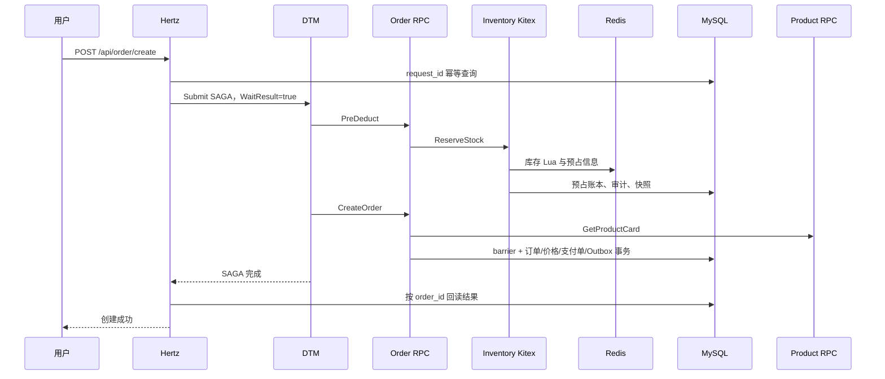

# Flash Mall 性能分析与优化决策

## 1. 结论

本轮完整套件证明公开读链路尚未触达容量边界，当前需要优化的是订单创建写链路。订单周期在 25 RPS 全部成功；目标升至 40 RPS 后，服务完成吞吐稳定在约 28.50 QPS，创建订单 p95 从 154.35 ms 跃升到 2851.61 ms，负载生成器开始持续丢弃排队请求。60 RPS 时完成吞吐仍只有约 27.90 QPS，说明系统形成约 28 QPS 的平台，而不是随目标流量继续扩展。

最值得优先验证的原因是 DTM 当前使用无持久卷的默认 BoltDB：每笔 SAGA 需要多次写全局事务和分支状态，而 BoltDB 写事务串行；这既可能形成并发瓶颈，也会在 DTM 容器重建时丢失未完成事务。现有证据支持该方向，但在完成 DTM 存储 A/B 实验前，不把它写成已经证实的唯一根因。

## 2. 证据范围

- 性能数据绑定提交：`ab99259bb847db10bbb00c45fef7407cd52657ff`。
- 测试环境：4 vCPU、约 7.76 GiB Ubuntu WSL Docker Engine。
- 固定夹具：`20260730_demo_fixture_v1`。
- 冻结结果：`benchmarks/results/performance-20260815.json`。
- 完整原始结果：`.runtime/performance/full-ab99259/`。
- 测试包含三轮基准、预期负载、压力阶梯、五分钟混合稳定性、支付、幂等、RabbitMQ 暂停恢复和最终一致性检查。

## 3. 测量口径修正

旧报告的 `qps` 使用“计划请求数（包含负载生成器丢弃）÷包含队列清空的总时间”，因此 40 RPS 档曾显示 34.57 QPS。未进入服务的请求不能算作完成吞吐，本轮已将口径修正为：

```text
completed_qps = (attempts - dropped) / elapsed_seconds
```

修正只改变派生统计，不改变原始请求、延迟、成功数、丢弃数和资源样本。以后 `qps` 统一表示收到响应的完成吞吐，`target_rps` 表示施加的目标流量，`dropped` 表示因持续排队未进入服务的请求。

## 4. 核心结果

| 场景 | 目标 RPS | 完成数 | 丢弃数 | 完成 QPS | 创建 p95 | 取消 p95 | 周期 p95 |
| --- | ---: | ---: | ---: | ---: | ---: | ---: | ---: |
| 订单压力 | 15 | 675 | 0 | 14.95 | 110.56 ms | 75.85 ms | 182.86 ms |
| 订单压力 | 25 | 1125 | 0 | 24.92 | 154.35 ms | 95.82 ms | 242.56 ms |
| 订单压力 | 40 | 1484 | 316 | 28.50 | 2851.61 ms | 103.69 ms | 2943.44 ms |
| 订单压力 | 60 | 1471 | 1229 | 27.90 | 2873.01 ms | 108.56 ms | 2967.41 ms |

公开读最高测试 3000 RPS，完成约 2999.93 QPS、135000 次全部成功、p95 0.476 ms。读路径与订单写路径的容量差异符合当前架构：公开读主要命中缓存和低跳数查询，订单创建需要 DTM、库存预占、商品报价、订单事务和结果回读。

40 RPS 订单档资源峰值：

| 组件 | 平均 CPU | 峰值 CPU |
| --- | ---: | ---: |
| Hertz | 5.70% | 6.72% |
| Order RPC | 11.02% | 12.45% |
| Inventory Kitex | 7.36% | 8.68% |
| DTM | 9.26% | 10.21% |
| MySQL | 18.29% | 20.38% |
| Redis | 2.68% | 3.92% |

MySQL `Threads_running` 峰值为 8，没有当前行锁等待或慢查询；CPU profile 主要落在 syscall、futex、网络和数据库 I/O，业务进程都没有计算资源饱和。现象更接近同步 I/O、持久化串行点或连接等待，而不是 Hertz/Kitex 编解码或 CPU 不足。

## 5. 当前创建订单链路



关键代码位置：

- `app/gateway/hertz/internal/handler/order.go`：同步提交 SAGA，并强制 `WaitResult=true`。
- `app/order/rpc/internal/logic/preDeductLogic.go`：DTM 库存预占分支转发 Kitex。
- `app/inventory/repository/stock_commands.go`：Redis Lua、MySQL 预占账本、审计日志和快照均处于同步路径。
- `app/order/rpc/internal/logic/createOrderLogic.go`：商品卡片 RPC、DTM barrier 和四类订单事实写入。
- `deploy/docker-compose.yml`：DTM 未提供配置文件和持久卷，实际日志显示使用默认 BoltDB。

## 6. 根因优先级

### H1：DTM BoltDB 写串行和非持久部署，置信度高

DTM v1.19.0 当前日志明确显示 `Store.Driver=boltdb`。DTM 的 BoltDB 实现使用多次 `DB.Update` 保存全局事务、分支和状态，写事务天然串行。40/60 RPS 时 DTM CPU 很低但整体吞吐形成稳定平台，符合等待型串行点的特征。DTM 又没有挂载数据卷，容器重建会失去未完成事务，因此无论性能实验结果如何，都应该把持久化存储列为 P0 工程修复。

### H2：库存预占同步路径承担了非关键投影，置信度中

ReserveStock 除 Lua 和预占账本外，还读取前后库存、写库存变更日志并更新库存快照。账本属于恢复所需事实，不能异步；审计日志和展示快照可以由可靠事件异步更新。当前实现虽然忽略部分投影错误，但仍同步等待其 I/O。

### H3：连接池没有显式容量和等待指标，置信度中

Order RPC、Hertz 查询仓储均直接使用 `sqlx.NewMysql`，未在项目层显式设置最大连接、空闲连接、生命周期，也未暴露 `database/sql.DBStats`。40 RPS 时 MySQL 活跃线程上升，但仅凭服务端线程数不能区分 DTM 存储等待、业务连接池等待和实际 SQL 执行时间。

### H4：同步 API 放大了过载尾延迟，置信度高

Hertz 在 `submitCreateOrderSaga` 中无条件设置 `WaitResult=true`，配置项目前无法真正关闭同步等待。仓库已经有 `/api/order/status?request_id=` 查询接口，但前端没有利用它。同步等待不是吞吐平台的唯一根因，却会让请求占用连接直到全部分支完成，并在过载时把排队直接暴露成三秒响应。

### H5：缺少写链路准入控制，置信度高

当前压力测试可以持续向已经只有约 28 QPS 完成能力的链路施加 40–60 RPS。系统没有依据在途请求、连接池等待或目标 SLO 对新下单请求快速拒绝，因此表现为尾延迟陡升和负载生成器队列丢弃。准入控制不会增加容量，但能让系统在容量之外保持可预测。

## 7. 优化选项

### P0-A：将 DTM 状态迁移到 MySQL，并做存储 A/B

- **改动：** 新增版本化 DTM schema 和显式配置，把 `Store.Driver` 从 BoltDB 改为 MySQL；DTM 使用独立 `dtm` schema、受限连接池和健康检查。
- **机制：** 用 InnoDB 并发事务替代单文件写串行，同时让未完成 SAGA 跨容器重建恢复。
- **收益：** 同时解决最可能的吞吐瓶颈和明确的事务状态持久化缺口，是最高杠杆改动。
- **风险：** DTM 与订单业务共用一个 MySQL 实例会争用 CPU、连接和刷盘；错误初始化可能删除已有 DTM 表。
- **控制：** schema 由项目迁移脚本创建，禁止 DTM 启动参数执行 destructive reset；独立数据库账号、连接上限和备份；保留 BoltDB Compose override 仅用于回滚对比。
- **验证：** 固定同一提交和夹具分别跑 BoltDB/MySQL 的 15/25/40/60 RPS；比较完成 QPS、create p95、DTM 状态写延迟、MySQL连接等待和全部一致性不变量。目标是 40 RPS 无丢弃且 create p95 小于 500 ms，或用数据否定该假设。
- **简历价值：** “通过端到端压力拐点和存储 A/B，将 DTM 从非持久 BoltDB 迁移到 MySQL，在保留 SAGA 恢复能力的同时消除事务状态串行瓶颈。”

### P0-B：补齐阻塞证据和连接池观测

- **改动：** 为 DTM Submit、PreDeduct、Kitex ReserveStock、GetProductCard、barrier、订单事务和结果回读增加独立直方图；暴露 Order/Hertz/Inventory 的 DBStats；压力档采集 goroutine、block、mutex profile。
- **机制：** CPU profile 看不到 goroutine 等待，分段指标和阻塞 profile 可以把三秒延迟归因到具体边界。
- **收益：** 避免在 DTM、MySQL和库存路径之间盲调，后续每次优化都能形成前后对照。
- **风险：** 高基数标签和 100% Trace 会反过来制造负载。
- **控制：** 标签只使用阶段名/结果类别，不使用订单 ID；保持 10% Trace；block/mutex profile 只在受控压力阶段开启。
- **验证：** 40 RPS 时所有创建订单耗时应能由各阶段近似解释，连接等待数和等待时长进入冻结报告。
- **简历价值：** “将订单端到端延迟拆到 DTM、Kitex、数据库事务与连接等待，并用 pprof 和资源时序定位吞吐拐点。”

### P1-A：缩短库存预占同步关键路径

- **改动：** 保留 Redis Lua 和 MySQL预占账本同步提交；将库存变更审计、展示快照刷新改为 Outbox 事件驱动投影，删除仅为审计而执行的前后库存读取。
- **机制：** 正确性路径只保存可恢复事实，派生视图异步重建，减少每次 ReserveStock 的 Redis/MySQL 往返。
- **收益：** 降低预占延迟和数据库写放大，同时复用项目已有 Outbox/RabbitMQ 能力。
- **风险：** 监控页面短暂看到旧快照，消费者失败会积压投影。
- **控制：** 交易校验仍以 Lua 预占结果和账本为准；快照标记更新时间；Outbox 重试、死信和重建任务覆盖恢复。
- **验证：** 单独测 ReserveStock p95、每订单 SQL/Redis 次数和 Outbox 积压；订单一致性不变量必须与改动前相同。
- **简历价值：** “按交易事实与派生视图拆分库存写路径，将审计和快照异步化以减少同步写放大。”

### P1-B：显式连接预算与背压

- **改动：** 为 Hertz 查询、Order RPC、Inventory 和 DTM 分配独立连接上限、空闲连接与生命周期，暴露等待指标；依据 4 vCPU 本地环境从保守值开始 A/B，而不是直接放大连接数。
- **机制：** 避免无限创建连接把排队推入 MySQL，也避免连接过少导致应用侧无可见等待。
- **收益：** 资源使用可预测，能区分容量不足和配置不当。
- **风险：** 上限过低会人为降低吞吐，上限过高会增加 MySQL 上下文切换。
- **控制：** 以等待率、事务延迟和 MySQL活跃线程共同调参；每次只修改一个服务的连接预算。
- **验证：** 在 25/40 RPS 比较 DBStats WaitCount、WaitDuration、连接峰值、p95 和失败率。
- **简历价值：** “建立微服务到 MySQL 的连接预算与等待指标，用背压替代无限连接扩张。”

### P1-C：订单创建准入控制

- **改动：** 对创建订单设置独立在途上限和令牌桶，超过安全容量返回 `429/Retry-After`；支付回调、取消补偿和库存恢复使用独立资源配额，不被普通下单挤占。
- **机制：** 在过载进入三秒排队前快速失败，保护补偿与支付等更高优先级工作。
- **收益：** 不增加理论容量，但显著改善过载时的尾延迟、可恢复性和用户反馈。
- **风险：** 阈值不合理会拒绝本可完成的流量；单实例限流不能代表集群全局容量。
- **控制：** 初始阈值按已验证的 25 RPS 以下设置并可配置；以后使用 Redis 或网关全局配额；返回稳定幂等语义，客户端按原 request_id 重试。
- **验证：** 60 RPS 压力下，已接收请求保持目标 p95，拒绝请求明确计数，补偿和支付恢复不受影响。
- **简历价值：** “基于实测容量拐点设计订单准入与优先级隔离，避免过载拖垮交易补偿链路。”

### P2-A：异步订单受理模式

- **改动：** 修复 `DtmWaitResult` 使其真实可配置；异步模式提交后返回 `202 + request_id + processing`，前端使用现有 `/api/order/status` 轮询，最终成功后进入支付。
- **机制：** HTTP 不再等待完整 SAGA，用户请求与后台事务执行解耦。
- **收益：** 高峰期响应更快、连接占用更短，并可结合准入队列平滑流量。
- **风险：** 只改善受理体验，不会自动提高底层 DTM 吞吐；需要处理提交成功但状态暂不可见、失败补偿和客户端重复轮询。
- **控制：** 同步模式保留为回滚开关；request_id 继续作为幂等身份；状态增加 processing/succeeded/failed/compensating，超时由恢复任务收敛。
- **验证：** 比较 API 受理 p95、最终订单完成时间、队列长度和失败恢复；禁止只拿 202 响应时间宣称交易吞吐提升。
- **简历价值：** “利用幂等 request_id 和订单状态查询实现同步/异步双模式，区分受理延迟与最终交易完成时间。”

### P2-B：用本地持久编排替换 DTM 创建链路

- **改动：** 架构替代方案是创建本地 `order_command`/Outbox 事实，由订单编排器依次调用 Kitex预占和订单落库，并以状态机、幂等命令和恢复扫描完成补偿。
- **机制：** 将仅有两个核心分支的创建链路收敛到项目自有持久状态机，减少外部协调器状态写和同步跳数。
- **收益：** 可针对业务定制批处理、优先级和恢复策略，理论上降低协调开销。
- **风险：** 需要自行承担 DTM 已提供的重试、空补偿、悬挂处理和运维能力，复杂度与正确性风险最高。
- **控制：** 先影子记录但不驱动库存，再对单一商品灰度；双写对账确认状态一致；保留 DTM 路径作为快速回滚。
- **验证：** 故障矩阵必须覆盖进程在每个状态点崩溃、重复消息、Kitex超时和数据库重启，并与 DTM 路径做性能和恢复能力对比。
- **简历价值：** “评估并灰度自研持久订单编排器，以业务状态机替代通用协调器，同时用故障矩阵守住补偿语义。”

## 8. 推荐实施顺序

| 顺序 | 工作 | 优先级 | 工作量 | 风险 | 进入下一步的条件 |
| --- | --- | --- | --- | --- | --- |
| 1 | 修正完成吞吐口径，增加分段/阻塞/连接池证据 | P0 | S–M | 低 | 40 RPS 三秒延迟可被阶段指标解释 |
| 2 | DTM BoltDB 与 MySQL 存储 A/B，随后持久化迁移 | P0 | M | 中 | 吞吐或恢复能力收益被实测确认 |
| 3 | 库存审计和快照退出同步路径 | P1 | M | 中 | 预占账本与最终一致性测试全部通过 |
| 4 | 调整连接预算并增加订单准入 | P1 | M | 中 | 60 RPS 过载时已接收流量不再三秒排队 |
| 5 | 评估异步受理 | P2 | M | 中 | 产品接受 processing 状态和轮询交互 |
| 6 | 仅在 DTM 仍是结构瓶颈时评估自有编排器 | P2 | L | 高 | 前述低风险优化无法达到目标 |

第一执行任务应是“DTM MySQL 存储 A/B + 分段观测”，而不是先改 Kitex、增加缓存或提高 Go 并发。公开读已经足够快；没有证据表明 Kitex CPU 或 Hertz 是当前瓶颈。
