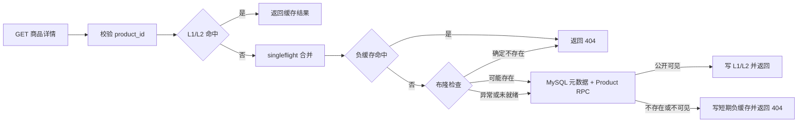

# 商品存在性过滤与负缓存设计

> 日期：2026-07-25
> 状态：已实施并完成 Docker 真实链路验证
> 决策：采用普通 Redis Bitmap 实现商品布隆过滤器，并以短期负缓存吸收假阳性和不可见商品请求。

## 1. 当前实现与问题根因

Flash Mall 的公开商品详情由 Hertz 的
`app/gateway/hertz/internal/handler/catalog.go` 提供。请求先进入统一缓存协调器：

- L1 是单进程短 TTL 缓存；
- L2 是 Redis 软/硬 TTL 缓存；
- L1/L2 均未命中后，通过 `singleflight` 合并同一 Hertz 进程内相同 Key 的并发回源；
- loader 查询 `catalogquery.ProductMetadata` 和 Product RPC；
- loader 返回 `product not found` 时，协调器不缓存错误。

这意味着重复请求同一个不存在的商品 ID 时，并发洪峰可以被单进程
`singleflight` 合并，但串行请求仍会反复访问 MySQL；使用大量随机合法正整数 ID
时，每个 ID 都会形成一次新的回源。当前代码没有负缓存或存在性过滤器，因此缓存穿透
仍未闭环。

项目默认 Compose 运行一个 Hertz；Kubernetes 清单运行两个 Hertz 副本。Redis 使用
普通 Redis 7，不包含 RedisBloom 模块。商品 ID 由商品写适配器按当前最大 ID 单调递增
分配；新商品先以离线状态写入 MySQL，库存初始化成功后才切换到期望状态。商品上下架
使用状态字段，不执行常规物理删除。这些现状适合使用“历史上曾创建过的商品 ID”
这一只增不删的布隆语义。

## 2. 目标

1. 随机不存在商品 ID 在缓存未命中后，不再访问 MySQL 或 Product RPC。
2. 同一不存在或不可见商品 ID 的重复请求由短期负缓存吸收。
3. 布隆过滤器只作为回源保护，不进入已有 L1/L2 命中路径。
4. Redis、过滤器元数据或重建过程异常时 fail-open，真实商品不能被错误返回为 404。
5. 多 Hertz 副本共享同一过滤器状态，重建不暴露半成品位图。
6. 新商品公开可见前必须已经加入过滤器，避免假阴性。
7. 保留现有 Hertz、Go-zero Product RPC、Kitex Inventory 和缓存失效边界。
8. 提供可量化的拒绝率、假阳性率、错误率和重建状态，用于 Grafana 与面试叙事。

## 3. 非目标

- 不给订单、用户、支付单、供应商或商家 ID 增加布隆过滤器。
- 不拦截列表、搜索、橱窗候选等集合查询。
- 不使用布隆结果判断商品上下架、店铺状态、权限、库存或价格。
- 不引入 RedisBloom、新 Redis 实例或新的网络服务。
- 不把商品读取迁移到 Kitex，也不修改 Product RPC IDL。
- 不在 Go-zero Entry API 基线重复实现本功能。
- 不通过运行时 DDL 创建表；本方案不需要新增业务表。

## 4. 业务不变量

1. 布隆返回“可能存在”只允许继续查询，不能证明商品可见。
2. 布隆返回“不存在”只有在 active generation 完整且 ready 时才允许直接返回 404。
3. Redis 超时、位图缺失、元数据不一致、版本切换中或过滤器关闭时必须正常回源。
4. 商品下架和物理删除不从布隆过滤器删除；残留位只会形成安全的假阳性。
5. 商品创建、离线恢复或上架时，必须先幂等 `Add(productID)`，再使商品公开可见。
6. 负缓存只保存公开查询的“当前不可见”结论，商品创建、上架或相关更新必须精确失效。
7. 过滤器不得成为商城读链路的强依赖；它只允许减少回源，不能降低已有可用性。

## 5. 总体数据流



布隆检查和负缓存检查放在 `loadCachedJSON` 的 loader 内部。这样已有正常缓存命中
不增加 Redis 往返；L1/L2 未命中后仍先由现有 `singleflight` 合并同 Key 并发。

## 6. 组件与文件职责

### 6.1 新增 `internal/existencefilter`

新增目录：

```text
app/gateway/hertz/internal/existencefilter/
├── filter.go
├── hash.go
├── redis_bitmap.go
├── rebuild.go
├── negative_cache.go
└── metrics.go
```

职责如下：

- `filter.go`：公开 `Filter` 接口、检查结果、配置和禁用实现；
- `hash.go`：基于现有 `xxhash/v2` 做双哈希，生成固定数量的位偏移；
- `redis_bitmap.go`：通过 Redis Pipeline 执行 `GETBIT`/`SETBIT`，读取 active generation；
- `rebuild.go`：分批扫描商品 ID、构建新 generation、原子切换 active 指针；
- `negative_cache.go`：管理带随机 TTL 的商品不可见标记；
- `metrics.go`：注册固定低基数 Prometheus 指标。

推荐接口：

```go
type Result string

const (
    ResultPossible Result = "possible"
    ResultAbsent   Result = "absent"
    ResultUnready  Result = "unready"
)

type Filter interface {
    Check(ctx context.Context, productID int64) (Result, error)
    Add(ctx context.Context, productID int64) error
    Rebuild(ctx context.Context) error
}

type NegativeCache interface {
    Contains(ctx context.Context, productID int64) (bool, error)
    Mark(ctx context.Context, productID int64) error
    Invalidate(ctx context.Context, productID int64) error
}
```

过滤器内部依赖 Redis 和商品 ID 数据源，Handler 只依赖接口，不接触 Redis 命令。

### 6.2 商品 ID 数据源

在 `application/catalogquery` 增加只读的批量 ID 迭代边界，在
`adapters/productmysql` 实现：

```sql
SELECT id
FROM mall_product.product
WHERE id > ?
ORDER BY id
LIMIT ?
```

默认批次 1000。扫描所有历史商品，不按商品或店铺状态过滤。适配器负责 SQL，
`existencefilter` 只消费 `IDSource` 接口，保持 Hertz Handler 无持久化依赖。

### 6.3 ServiceContext

在 `app/gateway/hertz/internal/svc/servicecontext.go` 装配：

- `ProductExistenceFilter existencefilter.Filter`
- `ProductNegativeCache existencefilter.NegativeCache`

复用现有 `cacheRedis` 客户端，不创建第二连接池。应用关闭时仍由 ServiceContext
统一关闭 Redis。

### 6.4 Handler

修改 `catalog.go` 的商品详情 loader：

1. 读取负缓存；
2. 读取布隆过滤器；
3. `absent` 时返回既有 `CodeProductNotFound`；
4. `possible`、`unready` 或错误时执行当前元数据与 Product RPC 查询；
5. 回源确认不存在或不可见时写负缓存；
6. 负缓存写入失败不覆盖原有 404，也不影响请求状态码。

修改商品创建、上架、更新及库存种子恢复链路，使新商品公开前完成 `Add`，并在
成功变更后删除精确负缓存。

## 7. Redis Key 与参数

统一前缀使用配置值，默认：

```text
flashmall:hertz:existence:product:active
flashmall:hertz:existence:product:g:{generation}:bits
flashmall:hertz:existence:product:g:{generation}:meta
flashmall:hertz:existence:product:rebuild-lock
flashmall:hertz:negative:product:{product_id}
```

第一版容量和误判率：

| 参数 | 默认值 |
| --- | ---: |
| 预计商品数量 n | 1,000,000 |
| 目标假阳性率 p | 1% |
| 位数 m | 9,585,059 bit |
| 位图大小 | 约 1.15 MiB |
| 哈希次数 k | 7 |
| 负缓存基础 TTL | 30 秒 |
| 负缓存抖动 | 0～10 秒 |
| Redis 单次操作超时 | 200 ms |
| 重建批次 | 1000 |

`meta` 保存 `state`、`bit_count`、`hash_count`、`count`、`built_at` 和算法版本。active Key 只保存
完整 generation ID。参数变化必须生成新 generation，不能原地解释旧位图。

## 8. 哈希与 Redis 操作

使用双哈希避免计算 7 次完整哈希：

```text
position(i) = (h1(productID) + i * h2(productID)) mod m
```

`h1`、`h2` 必须包含固定算法种子和 entity namespace；算法版本写入 metadata。
`h2` 为零时替换为固定非零常量。实现应产生完全确定的位偏移，并通过表驱动测试锁定，
避免升级后同一 ID 得到不同位置。

`Check` 使用 Pipeline 在一次网络往返内提交 7 个 `GETBIT`。任意一位为零即为
`absent`，全部为一返回 `possible`。`Add` 使用 Pipeline 提交 7 个 `SETBIT`；
重复添加天然幂等。Pipeline 或 metadata 任一错误均返回 error，由调用方 fail-open。

不把商品 ID、请求 ID 或 generation 放入 Prometheus 标签。

## 9. 初始化、重建与并发

### 9.1 启动

Hertz 启动不等待全量重建，不因过滤器不可用而启动失败：

1. 检查 active generation 及 metadata；
2. 完整且 ready 时直接使用；
3. 缺失或不合法时异步触发重建；
4. 重建完成前所有 `Check` 返回 `unready`，商品详情正常回源。

过滤器状态不进入 `/live` 和 `/ready` 的失败条件，但应在
`/api/system/health` 中作为可选能力显示 `ready/unready/degraded`。

### 9.2 版本化重建

1. 使用 `SET rebuild-lock <token> NX PX <ttl>`，确保多副本只有一个重建者；
2. 创建新 generation，metadata 初始为 `building`；
3. 分批读取商品 ID，并 Pipeline 写入新位图；
4. 写入最终数量、构建时间、参数和 `state=ready`；
5. 使用 Lua 校验 metadata 后原子切换 active；
6. 旧 generation 保留一小时，再由清理任务删除；
7. 使用 token 校验的 Lua 解锁，禁止误删其他实例续期后的锁。

重建失败不修改 active。旧 active 仍可用；若没有旧 active，则继续 fail-open。

### 9.3 定期校验

默认每六小时尝试一次重建，并允许通过管理命令或内部任务立即触发。定期重建用于：

- 修复历史导入或异常写链路漏加的 ID；
- 应用新的容量或哈希参数；
- 清理长期物理删除产生的无害假阳性；
- 验证 active metadata 与数据库商品数量差异。

## 10. 商品写链路一致性

商品写入事实仍属于 MySQL；过滤器不加入 MySQL 事务，也不使用 DTM。

当前创建流程先写入 `status=2` 离线商品，再由库存初始化器经 Kitex 写库存，最后将
商品状态更新为目标状态。实施后顺序固定为：

1. `ProductCommandRepository.Create` 提交离线商品与库存种子任务；
2. `ProductExistenceFilter.Add(productID)`；
3. Inventory Kitex 初始化库存；
4. MySQL 种子事务将商品切换为目标状态；
5. 刷新商品卡片快照；
6. 失效商品、店铺、橱窗和负缓存。

如果步骤 2 失败：

- 商品保持离线，已创建记录和种子任务不回滚；
- API 返回与库存初始化失败相同性质的“已创建但未发布完成”错误；
- 重试库存种子前先重新执行幂等 `Add`；
- 不允许后续步骤把商品变为公开状态。

管理员或商家将既有离线商品改为上架时，也必须先执行 `Add`。下架、改名、改价、
调库存只需要失效正常缓存和负缓存，不删除布隆位。

这一约束保证 Redis 恢复后不会使用旧 ready generation 把已经公开的新商品误判为
不存在。过滤器故障只影响新商品发布控制面，不影响已有商品读链路。

## 11. 负缓存语义

负缓存只保存公开商品详情的当前不可见结论，值使用固定版本标记，例如
`{"reason":"not_public","v":1}`，不保存数据库错误文本。

- TTL 为 `30s + [0,10s]` 稳定抖动；
- MySQL/RPC 超时、连接失败、解码错误不能写负缓存；
- 只有明确的 `ProductNotFound` 或商品/店铺不可见才写入；
- 布隆直接判定 absent 时可直接返回 404，不必再写负缓存；
- 商品创建、上架或影响可见性的更新必须删除该商品负缓存；
- Redis 错误时忽略负缓存能力并继续现有流程。

负缓存不复用普通 JSON 响应缓存，避免让通用协调器承担领域错误语义。

## 12. 配置

在 Hertz Config、Compose 配置和 K8s ConfigMap 增加：

```yaml
ProductExistenceFilterEnabled: false
ProductExistenceFilterPrefix: flashmall:hertz:existence:product
ProductExistenceFilterExpectedItems: 1000000
ProductExistenceFilterFalsePositiveRate: 0.01
ProductExistenceFilterRebuildHours: 6
ProductExistenceFilterBatchSize: 1000
ProductNegativeCacheTTLSeconds: 30
```

Go 配置零值保持关闭，Docker Compose 和 Kubernetes 开发部署配置在真实验收后已开启。
关闭时不装配过滤器和负缓存，不改变现有 API 行为。Redis 地址继续复用
`CacheRedisAddr`。

## 13. API、权限和错误映射

- 不新增公开 HTTP API，不改变现有商品详情成功响应结构。
- 合法但不存在的商品仍返回当前 `CodeProductNotFound` 和 HTTP 404。
- Redis/过滤器错误不暴露给用户，继续回源；仅记录结构化日志和指标。
- 重建属于后台内部任务，不向普通用户或商家开放。
- 如增加管理员手动重建入口，只允许现有 `RequireAdmin`，并返回任务已接受而非同步等待。
- 不在日志中记录大批攻击 ID；采样记录或只记录聚合计数，避免日志放大。

## 14. 可观测性

新增指标：

```text
flashmall_existence_filter_checks_total{entity,result}
flashmall_existence_filter_updates_total{entity,result}
flashmall_existence_filter_rebuild_total{entity,result}
flashmall_existence_filter_rebuild_duration_seconds{entity}
flashmall_existence_filter_items{entity}
flashmall_existence_filter_ready{entity}
flashmall_existence_filter_false_positive_total{entity}
flashmall_negative_cache_requests_total{entity,result}
```

`result` 使用固定集合：`possible`、`absent`、`unready`、`error`、`hit`、`miss`。
当布隆返回 possible 但权威查询确认不存在时增加假阳性计数。Grafana 应展示：

- 过滤拒绝率；
- 过滤器错误和未就绪比例；
- 观察假阳性率与配置目标的差异；
- 负缓存命中率；
- 重建耗时、加载数量和最近成功时间；
- 启用前后商品详情 origin 回源量及 p95。

## 15. 测试与真实验证

### 15.1 单元测试

- 哈希位置确定性、范围、非零步长和算法版本；
- 只要一位为零就返回 absent，全部为一返回 possible；
- Redis/metadata 错误返回 error，不返回 absent；
- `Add` 重复调用幂等；
- 负缓存 TTL、抖动、命中、失效；
- Handler 对 absent 返回既有 404，对 filter error 正常回源；
- 只有明确不存在结果写负缓存。

### 15.2 Redis 集成测试

使用 miniredis 覆盖位图和版本切换；使用真实 Redis 容器验证：

- Pipeline `GETBIT/SETBIT`；
- 两个过滤器实例共享 active generation；
- 重建锁 token 解锁；
- 构建中 generation 不可见；
- 原子切换后两个 Hertz 副本读取相同版本；
- Redis 关闭时 fail-open，恢复后重建可用。

### 15.3 商品生命周期验证

1. 创建离线商品并确认已加入过滤器；
2. 初始化库存并上架，详情可见；
3. 下架后详情 404 且负缓存命中；
4. 重新上架，负缓存被精确删除且详情立即可见；
5. 使用随机不存在 ID 验证不访问商品元数据与 Product RPC；
6. 故意设置高假阳性参数，确认权威查询仍返回正确 404；
7. 重建期间真实商品始终可访问。

### 15.4 构建与运行命令

```bash
go test ./app/gateway/hertz/internal/existencefilter/... -count=1
go test ./app/gateway/hertz/internal/handler/... -count=1
go test ./app/gateway/hertz/... -count=1
go vet ./app/gateway/hertz/...
./scripts/local/rebuild-compose-service.sh hertz-gateway
./scripts/local/health-compose.sh
```

使用本机回环地址发送存在、重复不存在和随机不存在商品详情请求；同时观察 `/metrics`、
Hertz 日志、MySQL 查询计数和 Product RPC 请求量。验收产生的临时商品必须恢复为离线
或删除，不能影响首页橱窗和现有商家数据。

## 16. 实施顺序

1. 增加配置、接口、禁用实现、哈希与 Redis Bitmap 基础实现。
2. 增加商品 IDSource、版本化重建和重建锁。
3. 在 ServiceContext 装配，共享现有 Redis 客户端并启动异步校验。
4. 在商品详情 loader 内接入负缓存与布隆检查。
5. 收口商品创建、库存种子重试和上架顺序，保证先 Add 再公开。
6. 接入精确负缓存失效和现有正常缓存失效。
7. 增加指标、健康详情和 Grafana 查询。
8. 完成单元、集成、Docker 双实例行为和故障恢复验证。
9. 更新 `docs/CURRENT_PROJECT.md`，只记录最终已实现能力和验证结果。

## 17. 兼容、回滚与提交边界

兼容策略：

- 功能开关关闭时完全复用当前回源路径；
- API、数据库 schema、Product RPC 和前端无契约变化；
- 旧 Redis 中不存在相关 Key 时自动 unready 并 fail-open。

回滚方式：

1. 将 `ProductExistenceFilterEnabled` 设为 false 并重启 Hertz；
2. 正常读链路立即恢复当前行为；
3. 可异步删除 `flashmall:hertz:existence:product:*` 和
   `flashmall:hertz:negative:product:*`；
4. 不回滚 MySQL、库存、商品状态或普通缓存数据。

实施提交保持在 `codex/arch-hertz-kitex`，不合并 `main`，也不向冻结的 Entry API
复制实现。建议拆为两个可独立审查的提交：

1. `feat: 增加商品存在性过滤与负缓存`
2. `docs: 记录缓存穿透防护与真实验证`

除非用户另行要求，完成验证后推送当前开发分支，不创建合并到 `main` 的 PR。

## 18. 验收标准

- 过滤器 ready 时，随机不存在商品 ID 不执行商品元数据查询或 Product RPC；
- 同一不可见商品的第二次请求命中负缓存；
- 真实商品在过滤器关闭、未就绪、Redis 关闭和重建期间始终能正常回源；
- 新商品上架前已经存在于 active 布隆过滤器；
- 下架后不删除布隆位，重新上架立即清理负缓存；
- 两个 Hertz 副本共享 active generation；
- 重建失败不切换 active，不暴露 building generation；
- 指标能够区分 possible、absent、unready、error 和假阳性；
- Hertz 测试、vet、Docker 健康检查和真实商品生命周期全部通过；
- 未修改 Go-zero Entry API、Product RPC IDL、Kitex IDL 或前端契约。
